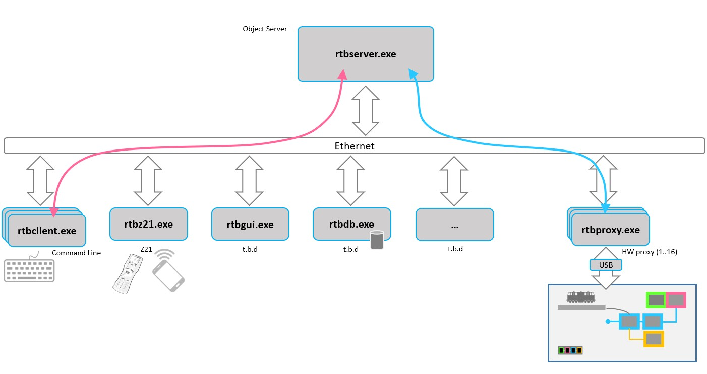

# RTB_suite
[](https://www.rtb4dcc.de)
[](https://codeberg.org/git4dcc/RTB_suite)
[](https://www.apache.org/licenses/LICENSE-2.0)

**A distributed, PC-based DCC command station and layout control suite.**<br><br>
Operating in a distributed IP network environment, this software generates real-time DCC commands on a host PC and broadcasts them via a **low-latency bus** to physical layout hardware. It is engineered to scale across multiple systems, ensuring precise and immediate command execution across any size of model railway.


<details>
<summary>User Guides</summary>

- [User Guide - DE](https://rtb4dcc.de/rtb_minimal_guide_de/)
- [User Guide - EN](https://rtb4dcc.de/rtb_minimal_guide_en/)

</details>




## Package versions
```
Filename format: RtbSuite_YYYYMMDD.zip
```
Note: I will manage a maximum of 12 package drops here in GitHub and remove the oldest one as soon as it is reached.

| File | Type | Description |
| --- | --- | --- |
<<<<<<< HEAD
| [RtbSuite_20251214](https://codeberg.org/git4dcc/RTB_suite/src/branch/main/x64/RtbSuite_20251214.zip) | zip | :white_check_mark: **add:** Zimo MDU protocol for MS/MN decoder updates |
| [RtbSuite_20260115](https://codeberg.org/git4dcc/RTB_suite/src/branch/main/x64/RtbSuite_20260115.zip) | zip | :white_check_mark: **add:** Zimo DECUP protocol for MX decoder updates |
=======
| [RtbSuite_20251214](https://github.com/git4dcc/RTB_suite/blob/main/x64/RtbSuite_20251214.zip) | zip | :white_check_mark: **add:** Zimo MDU protocol for MS/MN decoder updates |
| [RtbSuite_20260115](https://github.com/git4dcc/RTB_suite/blob/main/x64/RtbSuite_20260115.zip) | zip | :white_check_mark: **add:** Zimo DECUP protocol for MX decoder updates |
| [RtbSuite_20260126](https://github.com/git4dcc/RTB_suite/blob/main/x64/RtbSuite_20260126.zip) | zip | :white_check_mark: **add:** Ghostbuster Service, SX2 para reading |
>>>>>>> 1d17ec0bce63a2792dcc1f9dd9bb2ef9b1a3bac9

<br>

## Installation
<<<<<<< HEAD
To deploy the suite, simply download and extract the [packages](https://codeberg.org/git4dcc/RTB_suite/src/branch/main/x64) into your preferred directory. The software is designed for immediate, out-of-the-box use, requiring no formal installation or uninstallation procedures.
=======
To deploy the suite, simply download and extract the [packages](https://github.com/git4dcc/RTB_suite/tree/main/x64) into your preferred directory. The software is designed for immediate, out-of-the-box use, requiring no formal installation or uninstallation procedures.
>>>>>>> 1d17ec0bce63a2792dcc1f9dd9bb2ef9b1a3bac9


| File | Type | Description |
| --- | --- | --- |
| rtbserver | exe | Central object repository server |
| rtbproxy | exe | Layout proxy agent |
| rtbclient | exe | Universal command line interface |
| rtbz21 | exe | Z21 emulator integrating hand held Roco WLAN Mouse |
| rtbftdi | exe | USB helper program scanning the USB for connected FTDI devices |
| rtbcor | dll | Basic object behavior implementation |
| rtbrpc | dll | Distributed object behavior implementation (publish/subscriber) |
| **FW** | subdir | :file_folder: contains Cxx firmware (.hex) files. Will be installed automatically during startup. |

<br>

## Startup
Deployment is straightforward and requires no initial configuration. Simply launch the server process first; by default, clients automatically connect via loopback. For distributed setups, users only need to specify the server’s IP or hostname to establish a remote connection.

| Steps | Example Video |
| --- | --- |
| <ul><li>Connect the module via **USB**</li><li>Start **rtbserver.exe** in a command window</li><li>Start **rtbproxy.exe** in a command window</li></ul><br>You are now up and running! | [](https://youtu.be/FtHR6CCo5IE?t=1m6s) |

<br>

# YouTube
A couple of YouTube videos on different use-cases (currently German language, but I plan to redo them in english).<br><br>

| Video #1 | Video #2 | Video #3 |
| --- | --- | --- |
| [](https://youtu.be/Au-6CpvpdI8) | [](https://youtu.be/YBKRzL3ug-c) | [](https://youtu.be/InFnjWulHMA?t=1m0s) |
| Hardware assembly | Automatic decoder detection | My DIY decoder development |

| Video #4 | Video #5 | Video #6 |
| --- | --- | --- |
| [](https://youtu.be/afoW1E1A6Zc) | [](https://youtu.be/ZyTRiSBSxrk) | [](https://youtu.be/AxBWCUPm_NM) |
| My DIY decoder SW update | Zimo MS/MN decoder SW update | Zimo MX decoder SW update |

| Video #7 | Video #8 |
| --- | --- |
| [](https://youtu.be/5cwDDU8UXBs) | [](https://youtu.be/_8BLXk0jF0M) |
| Railcom Ghostbusting | D&H decoder SW update |

This project is intended for hobby use only and is distributed in accordance with the Apache License 2.0 agreement.
